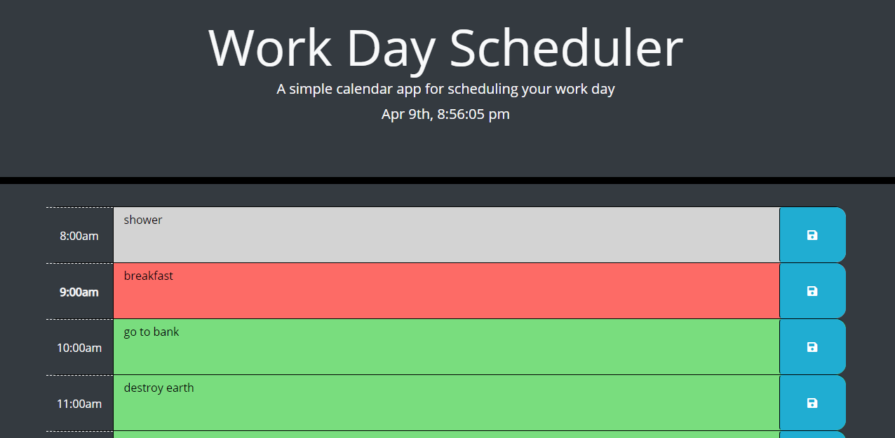

# Work Day Scheduler

## Description:
    This is a work day schedule planner that can store information and visually inform you of when said information is due.

## HTML: 
    Contains many divs to allow for the user to enter their information for a given time

## CSS:
    alongside bootstrap it is used to format the page into a dark theme while providing visuals to the user of past present or future times for an event

## JS:
    Displays date & time. Uses the button in HTML to save user-inputted events into local storage and keep them displayed even when page is refreshed. Adds custom classes to event blocks to signify what event is due/will be due/past due

## Link: 
    https://jfig27.github.io/Work-Day-Scheduler/index.html

## Screenshots: 
